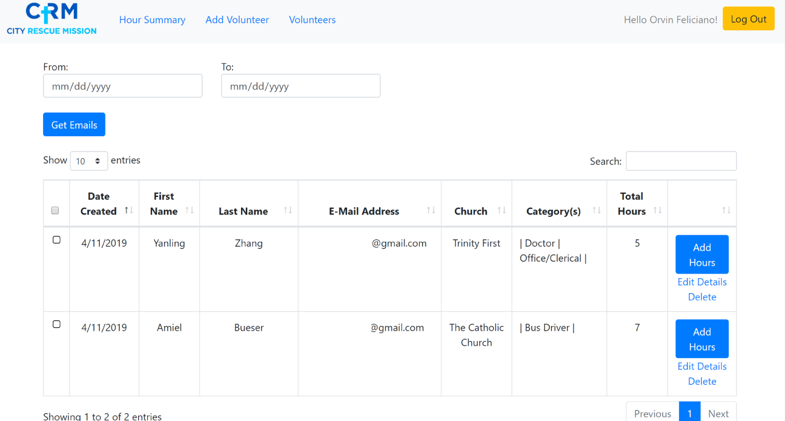
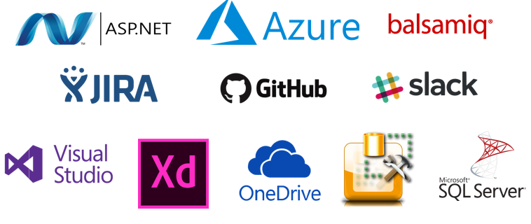

# City Rescue Mission Volunteer Management System

        

## Table of Contents

- [Background](#background)
- [Goals of the Project](#goals-of-the-project)
- [Technology](#technology)
- [Contributors](#contributors)

## Background
At the University of North Florida (UNF), students studying Information Systems are required to take a  Community-Based Transformational Learning (CBTL) course. This project is the result of the collaboration between four UNF students, IT professionals from Feature[23] (mentors), City Rescue Mission (client) and Karthikeyan Umapathy (instructor).

### About City Rescue Mission
>City Rescue Mission has been serving the homeless and needy in Northeast Florida since 1946.

>The original vision of offering “soup, soap and salvation” to alcoholics has evolved into a privately funded nonprofit organization whose mission is to rebuild the lives of the homeless and needy through life building programs and the love and compassion of Jesus Christ.

>City Rescue Mission, Inc. is a 501(c)(3) corporation that provides food, clothing, shelter, emergency services and residential recovery programs to homeless men, women, and women with children. City Rescue Mission does not accept government funding. Financial support of the Mission comes from donations made generously by concerned individuals, churches, businesses, civic organizations, and foundations.

## Goals of the Project
The goal of this project is to develop a management system for City Rescue Mission (CRM) to manage their volunteers. This volunteer management system (VMS) is meant to improve CRM's processes for managing and recruiting volunteers. Before this solution, CRM was using a paper based system to keep track and manage volunteer information and volunteer hours. This solution will also aid CRM in efficiently retrieving data for performance evaluation purposes.

## Technologies

        

## Contributors and Collaborators
The Team:

   

Instructor and Mentors

